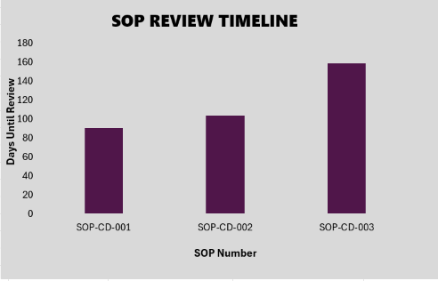

# SOP and QMS Documentation Version-Control Tracker

## Problem

Clinical trial teams rely on Standard Operating Procedures (SOPs) to keep processes consistent, auditable, and compliant with Good Clinical Practice (GCP).

When SOPs are revised, changes need to be tracked accurately: what changed, why it changed, and whether the change improves data quality or introduces risk.

AI tools can speed up document review, but AI-generated summaries are not automatically trustworthy. This project examines the gap between automated document comparison and meaningful human review.

## Approach

Three clinical data SOPs were developed:

* **SOP-CD-001 — Query Resolution**
* **SOP-CD-002 — Data Entry**
* **SOP-CD-003 — Database Lock**

Each SOP was drafted as version 1.0 and subsequently revised to version 2.0 with substantive changes.

The six SOP documents were compared using an AI assistant to identify section-by-section differences. Each AI-generated comparison was then manually checked against the original documents.

The changes were also reviewed from a clinical data management and data-integrity perspective to determine whether they strengthened or weakened the underlying process.

An Excel-based version-control log was created to track:

* SOP number
* SOP title
* Version
* Effective date
* Approver
* Change summary
* Last review date

A second worksheet provides a status dashboard showing the current SOP version, next review due date, days remaining until review, and review status using formulas and conditional formatting.

## Skills Demonstrated

* SOP documentation and revision control
* QMS documentation practices
* Document version comparison and change tracking
* AI-assisted document review
* Human review and data-integrity assessment
* Excel-based version-control tracking
* Formula-driven monitoring and conditional formatting
* Clinical Data Management principles
* GCP and data-integrity awareness

## Result

All three SOPs were completed at both version 1.0 and version 2.0, with consistent headers and footers.

The AI comparison correctly identified the textual changes between the SOP versions. However, it consistently showed limitations when interpreting the operational and clinical significance of those changes.

The version-control log and dashboard were functional, with live formulas that update automatically as dates change.

## Dashboard

The Excel version-control tracker includes a status dashboard showing current SOP versions, upcoming review dates, days remaining until review, and review status.

## Limitations

AI-assisted comparison was reliable for detecting textual changes but less reliable for determining why those changes matter from a clinical data and data-integrity perspective.

Manual review identified several important issues:

### 1. Shortened response and resolution deadlines

The Query Resolution SOP changed the response/resolution deadline from 3 business days to 1 business day, while the Database Lock SOP changed a deadline from 10 days to 7 days.

The AI correctly identified the numerical changes but did not identify the potential operational risk of fixed shortened deadlines pressuring staff to close queries before they are properly resolved, particularly where clinical information may still be evolving.

### 2. Incomplete data-entry rules

The Data Entry SOP added a specific rule for free-text fields. However, neither version contained an equivalent explicit rule for numeric fields.

This creates a potential data-integrity concern because rounding or approximating laboratory values could be more significant than paraphrasing free-text information. The AI did not identify this issue because the omission existed in both versions and therefore did not appear as a version-to-version change.

### 3. Source documentation and EDC timing

Neither version of the Data Entry SOP clearly distinguished between completing source documentation at the clinical visit and subsequently entering information into the EDC system.

This ambiguity could potentially be interpreted as allowing source documentation to be delayed, which could undermine the principle of contemporaneous documentation.

### 4. Database lock readiness

Version 1.0 of the Database Lock SOP did not include a formal pre-lock checklist confirming that queries were closed and source data had been verified before lock approval.

Version 2.0 corrected this gap by introducing a more structured pre-lock process.

The AI identified the newly added section but did not fully assess the significance of the control gap that existed in version 1.0.

## Conclusion

AI-assisted document comparison is useful as a first-pass review tool because it can efficiently identify textual differences between document versions.

However, automated comparison does not replace human judgement.

A complete SOP review should consider not only **what changed**, but also **why the change matters, what risk it introduces, and whether the revised process supports data quality and integrity**.

AI-generated summaries should therefore be treated as a starting point for human review rather than as the review itself.
